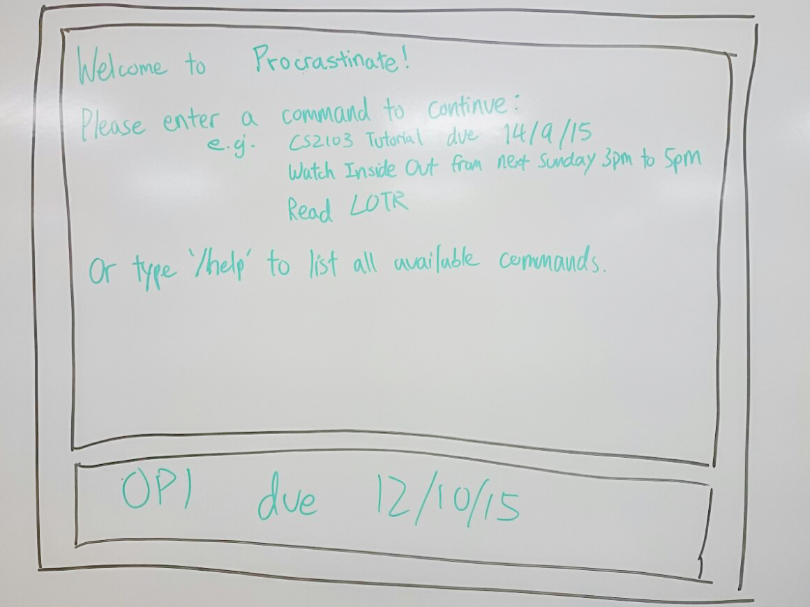
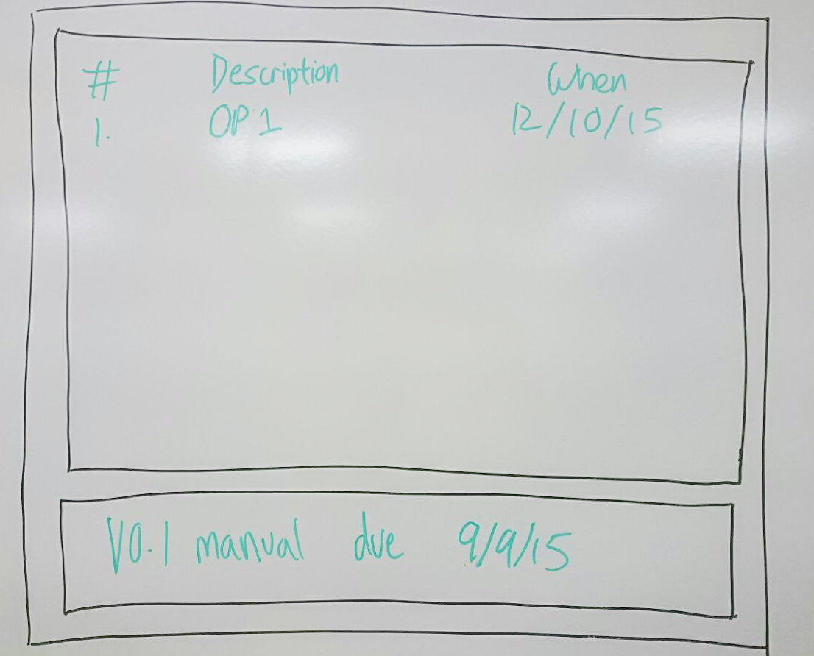

# About

**Procrastinate** is a to-do manager optimised for *speed* and *ease of use* via *typing*.

# Table of Contents

- [Quick Start](#quick-start)
- [Other Features](#other-features)
- [Possible Extensions](#possible-extensions)
- [Cheatsheet](#cheatsheet)

# Quick Start 

1. **Welcome Screen** 
When you first start up the program, you will be greeted with the following screen:

  
A sample list of commands will be shown. If the user needs more help, they can type `/help` for a more detailed description guide.

2. **Adding a Task** 
You interact with the programme by typing simple commands. This sample command `OP1 due 12/10/15` will add a new **deadline** and produce the following screen after being read into the program:

  
*To minimise the number of words users have to type, we have omitted the use of the command `add`, which will be automatically assumed for all inputs unless otherwise specified. Items are automatically sorted by their due date. Also note that dates are translated to relative dates for imminent events.*

3. **Modifying a Task** 
You can modify an existing task by using the `edit` command, specifying its line number and updated description. For example, `edit 2 OP2` changes the description of task 2 to "OP2".

  
*A user can also change the due date by specifying it as an optional parameter after the description.*

4. **Delete, Undo, and Command Stacking** 
You can delete tasks using the `delete` command, specifying the line number of the task. The changes made by the last command can be undone using `undo`. Multiple commands can also be stacked within an input, using `&&` as a separator between commands.

5. **Deadlines, Events and Dreams** 
As opposed to **deadlines**, which only have a due date, **events** have a start and end time. On the other hand, **dreams** do not have any associated date - they only need to be done *eventually*. **Deadlines**, **events** and **dreams** are collectively called **tasks**.

  
*For* **_events_**, *date and time can be specified as a range and can span across multiple days. Final date can be left out if end time is on the same day.*
 
*For* **_dreams_**, *date and time are left out.*

6. **Mark Done** 

  
*When tasks are marked as done, they will be archived and removed from the current view in order to keep the list clutter-free.*

7. **More Commands**: 
To view more commands and functionalities of **Procrastinate**, please refer to the *[Cheatsheet](#cheatsheet)* section below.

# Other Features
> Likely to be implemented

1. GUI for Procrastinate. Have a simple GUI for the app so that it looks more friendly and appealing to its users.
2. Define personalised shortcuts. User can define their own personalised shortcuts so that frequently used commands can be made shorter by them. If any commands do not appeal to their taste, they will have a choice of changing it.
3. Have predefined shorthand commands to further reduce the amount of typing for the user.
4. Have a shortcut command to launch the program directly.
5. Alert users whenever there is any clash in their schedule.
6. Allow users to add recurring tasks.
7. Able to view items on a specific date.
8. Able to add tags to categorise all my items.
9. Able to specify a data storage location for the task list, to access the data for manual edit and allow access across devices through cloud synchronization services.
10. Users should be automatically reminded of upcoming deadlines so that they will not miss them.
11. Able to set reminder frequency
12. Able to search items by description

# Possible Extensions
> Nice to have

1. Able to search items by tags
2. Able to search items by title
3. Able to search with non-exact words (fuzzy search)
4. Able to import Google Calendar events
5. Have follow up commands suggested to the user
6. View the list with color code so categories are clear
7. Suggestions of wrongly typed command
8. Autocomplete of command
9. Customisable GUI
10. Have text and audio based alerts/reminders
11. Have a history of past items
12. Allow block booking
13. Automatically release all other reserved slots

# Cheatsheet 
Command     | Usage |Description
------------|-------|-------------
            | `<description>` due `<date>` | Adds a deadline with `<description>` and the corresponding due `<date>`.
            | `<description>` from `<start>` to `<end>` | Adds an event with `<description>` and the corresponding `<start>` and `<end>` times.
            | `<description>` | Adds a dream with `<description>` and no end time.
`edit`      | `<line number>` `<new description>` | Updates an existing task with the corresponding `<line number>` with the `<new description>`.
`delete`    | `<line number>` | Deletes the task with the corresponding `<line number>` specified.
`undo`      | | Undoes the changes you have made in the last command.
`done`      | `<line number>` | Marks the task with the corresponding `<line number>` as done.
`exit` `procrastinate`      | | Exit Procrastinate.
*You can stack multiple commands using `<COMMAND1>` `&&` `<COMMAND2>`.*
